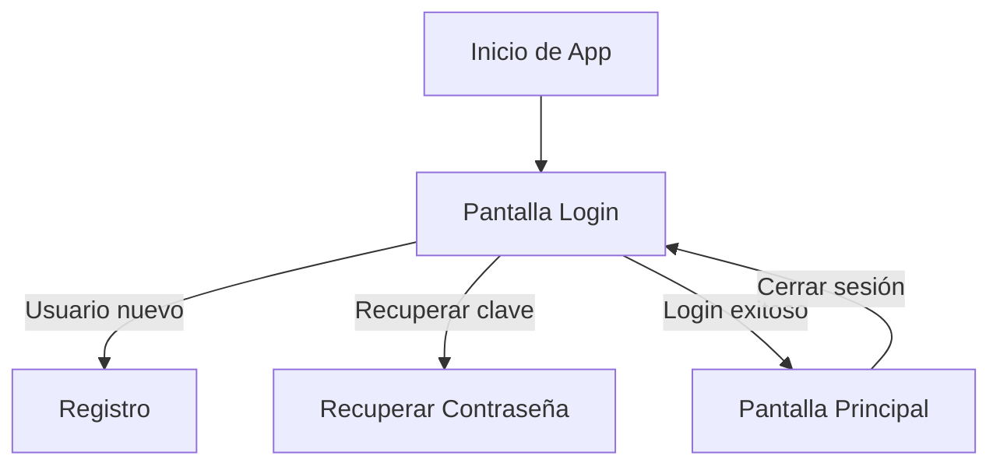

# 📱 AppDuoc_Profe

Aplicación Android desarrollada en **Kotlin** utilizando **Jetpack Compose**, **Firebase Authentication** y el patrón de arquitectura **MVVM**.  
El proyecto forma parte de los módulos de desarrollo móvil del **Instituto Profesional Duoc UC** y tiene como objetivo ilustrar el flujo de autenticación, recuperación de contraseña y navegación dentro de una app moderna basada en Compose.

---

## 🚀 Características principales

- 🔐 **Autenticación con Firebase** (login, registro y recuperación de contraseña)
- 🧭 **Navegación con Jetpack Compose Navigation**
- 🧱 **Arquitectura MVVM** (Model–View–ViewModel)
- 🌗 **Interfaz moderna con Material Design 3 (Material You)**
- ⚙️ **Validaciones de formulario y manejo de errores**
- 📡 **Integración en tiempo real con Firebase Authentication**
- 🔄 **Recuperación de contraseña vía correo electrónico**
- 📲 **Compatibilidad con Android 12+ (SDK 31 en adelante)**

---

## 🧩 Estructura del proyecto

```
appduoc_profe/
│
├── app/
│   ├── src/
│   │   ├── main/
│   │   │   ├── java/cl/daeriquelme/appduoc_profe/
│   │   │   │   ├── ui/
│   │   │   │   │   ├── login/         → Pantalla de inicio de sesión
│   │   │   │   │   ├── register/      → Pantalla de registro de usuario
│   │   │   │   │   ├── recover/       → Pantalla de recuperación de contraseña
│   │   │   │   │   ├── home/          → Pantalla principal tras el login
│   │   │   │   │   ├── theme/         → Definición de colores, tipografía y estilos
│   │   │   │   └── AppDuoc_ProfeApp.kt → Composición principal de la aplicación
│   │   │   ├── res/
│   │   │   │   ├── drawable/          → Íconos e imágenes
│   │   │   │   ├── values/            → Strings, colores y temas
│   │   │   └── AndroidManifest.xml
│   ├── build.gradle.kts
│   └── google-services.json
│
├── build.gradle.kts
└── settings.gradle.kts
```

---

## 🧠 Arquitectura MVVM

El proyecto utiliza la arquitectura **MVVM (Model-View-ViewModel)** para mantener una separación clara de responsabilidades:

| Capa               | Descripción                                               | Ejemplo                           |
| ------------------ | --------------------------------------------------------- | --------------------------------- |
| **Model**          | Contiene la lógica de negocio y las clases de datos.      | `User.kt`                         |
| **ViewModel**      | Gestiona el estado de la UI y comunica con Firebase.      | `LoginViewModel.kt`               |
| **View (Compose)** | Interfaz declarativa que observa el estado del ViewModel. | `LoginScreen.kt`, `HomeScreen.kt` |

---

## 🔧 Configuración del entorno

### 1. Requisitos previos

- Android Studio **Koala** o superior
- Kotlin **1.9+**
- Gradle **8.0+**
- Cuenta y proyecto configurado en **Firebase Console**

### 2. Clonar el repositorio

```bash
git clone https://github.com/tuusuario/AppDuoc_Profe.git
cd AppDuoc_Profe
```

### 3. Agregar el archivo `google-services.json`

Descarga tu archivo desde Firebase Console y colócalo en:

```
app/google-services.json
```

### 4. Sincronizar dependencias

En Android Studio, selecciona:

```
File → Sync Project with Gradle Files
```

### 5. Ejecutar el proyecto

Selecciona un emulador o dispositivo físico y haz clic en ▶️ **Run App**.

---

## 📦 Dependencias principales

```kotlin
// Jetpack Compose
implementation("androidx.compose.ui:ui:1.7.0")
implementation("androidx.compose.material3:material3:1.3.0")
implementation("androidx.navigation:navigation-compose:2.8.0")

// Firebase
implementation("com.google.firebase:firebase-auth-ktx:23.0.0")
implementation("com.google.firebase:firebase-analytics-ktx")

// Lifecycle y ViewModel
implementation("androidx.lifecycle:lifecycle-runtime-compose:2.8.0")
implementation("androidx.lifecycle:lifecycle-viewmodel-compose:2.8.0")

// Kotlin y Coroutines
implementation("org.jetbrains.kotlinx:kotlinx-coroutines-android:1.8.0")
```

---

## 🧰 Funcionalidades implementadas

| Pantalla                 | Descripción                                             |
| ------------------------ | ------------------------------------------------------- |
| **Login**                | Inicio de sesión mediante correo y contraseña           |
| **Registro**             | Creación de cuenta con validación de email y contraseña |
| **Recuperar contraseña** | Envío de enlace de restablecimiento desde Firebase      |
| **Principal**            | Muestra saludo con el usuario autenticado               |
| **Logout**               | Permite cerrar sesión y volver al login                 |

---

## 💡 Ejemplo de flujo



---

## 🧑‍💻 Autor

**Profesor Daniel Riquelme**  
📧 [daeriquelme@duocuc.cl](mailto:daeriquelme@duocuc.cl)  
🏫 Duoc UC - Escuela de Informática y Telecomunicaciones

---

## 📄 Licencia

Este proyecto se distribuye bajo la licencia **MIT**, lo que permite su uso académico y educativo sin restricciones.

---

## 🧭 Próximas mejoras

- 🌐 Conexión a servicios REST externos
- 🎨 Animaciones y transiciones personalizadas en Compose
